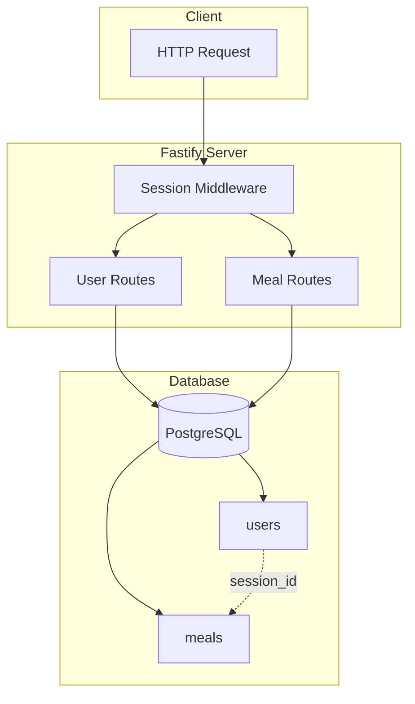

# Daily Diet API

REST API for tracking daily meals and diet compliance. Built as a practical challenge from Rocketseat's Node.js course.

## Tech Stack

- **Fastify** - Web framework
- **Knex** - SQL query builder (SQLite locally, PostgreSQL in production)
- **Zod** - Schema validation
- **Vitest + Supertest** - Automated testing

## Architecture



## API Endpoints

### Users

| Method | Route        | Description    |
| ------ | ------------ | -------------- |
| POST   | `/users`     | Create user    |
| GET    | `/users`     | List all users |
| PUT    | `/users/:id` | Update user    |
| DELETE | `/users/:id` | Delete user    |

> **Note:** GET, PUT, and DELETE user routes were implemented as an extension beyond the original challenge requirements.

### Meals

| Method | Route                           | Description           |
| ------ | ------------------------------- | --------------------- |
| POST   | `/meals`                        | Create meal           |
| GET    | `/meals`                        | List user's meals     |
| GET    | `/meals/:id`                    | Get single meal       |
| PUT    | `/meals/:id`                    | Update meal           |
| DELETE | `/meals/:id`                    | Delete meal           |
| GET    | `/meals/summary`                | Total meals count     |
| GET    | `/meals/summary/diet-compliant` | On/off diet breakdown |
| GET    | `/meals/streak`                 | Best diet streak      |

## Running Locally

```bash
# Install dependencies
pnpm install

# Run migrations
pnpm knex migrate:latest

# Start development server
pnpm dev

# Run tests
pnpm test
```

## Session Management

User identification is handled via cookies. A `sessionId` is automatically generated on user creation and persists for 7 days.

## Deployment

The API is deployed on **Render** with PostgreSQL.

**Base URL:** https://daily-diet-api-9rlr.onrender.com

You can test the endpoints using tools like Insomnia or Postman.
